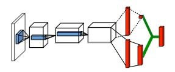
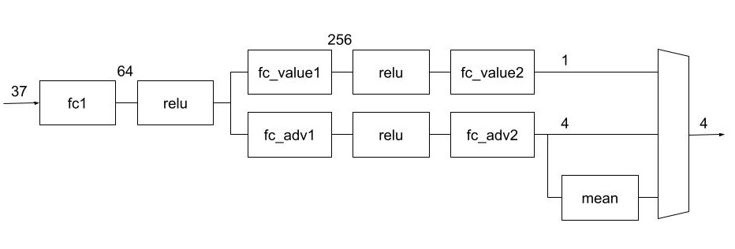
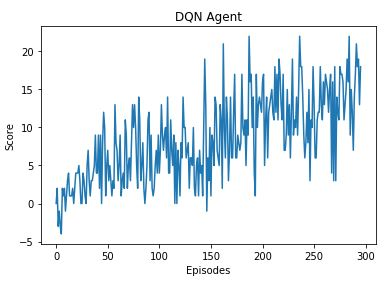
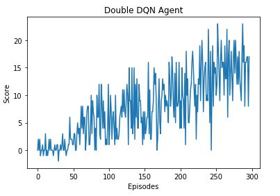
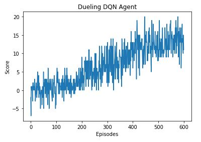
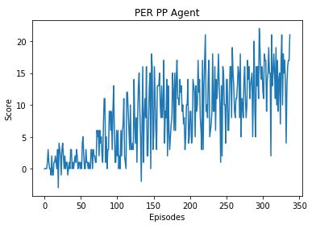
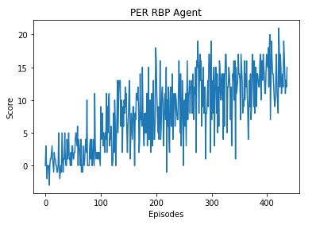

# Report

This notebook is a project summary report for the first project submission 'Navigation for the Udacity Ud893 Deep Reinforcement Learning Nanodegree (DRLND). As such it includes a decription of the implementation, learning algorithm(s), hyperparameters, neural net model architectures, reward/episode plots and ideas for future work.

## Implementation

### Goal and Environment

The goal of the project is to develop and train an agent to navigate in a large, square world (environment) and collect items - specifically, to collect yellow bananas, while avoiding blue bananas. This environment is similar to the Banana Collector environment on the [Unity ML-Agents GitHub page](https://github.com/Unity-Technologies/ml-agents/blob/main/docs/Learning-Environment-Examples.md#banana-collector).


A reward of +1 is provided for collecting a yellow banana, and a reward of -1 is provided for collecting a blue banana. Thus, the goal of the agent is to collect as many yellow bananas as possible while avoiding blue bananas.

The state space has 37 dimensions and contains the agent's velocity, along with ray-based perception of objects around agent's forward direction. Given this information, the agent has to learn how to best select actions. Four discrete actions are available, corresponding to:

- **`0`** - move forward.
- **`1`** - move backward.
- **`2`** - turn left.
- **`3`** - turn right.

The task is episodic, and in order to solve the environment, the agent must get an average score of +13 over 100 consecutive episodes.

### Files

The following provides a list of the key files and directories in the main project directory and their function.

| <p align="left">Filename</p>              | <p align="left">Function</p>                                                                      |
| :---------------------------------------- | :------------------------------------------------------------------------------------------------ |
| <p align="left">README.md</p>             | <p align="left">Main readme</p>                                                                   |
| <p align="left">Report.md</p>             | <p align="left">Report readme markdown</p>                                                        |
| <p align="left">Report.ipynb</p>          | <p align="left">Report python notebook</p>                                                        |
| <p align="left">Project 1.ipynb</p>       | <p align="left">Main training loop python notebook</p>                                            |
| <p align="left">dqn_agent.py</p>          | <p align="left">DQN agent python file</p>                                                         |
| <p align="left">double_dqn_agent.py</p>   | <p align="left">Double DQN agent python file</p>                                                  |
| <p align="left">dueling_dqn_agent.py</p>  | <p align="left">Dueling DQN agent python file</p>                                                 |
| <p align="left">PER_PP_agent.py</p>       | <p align="left">Prioritized experience replay (proportional prioritization) agent python file</p> |
| <p align="left">PER_RBP_agent.py</p>      | <p align="left">Prioritized experience replay (rank based prioritization) agent python file</p>   |
| <p align="left">model.py</p>              | <p align="left">Python Pytorch neural network file</p>                                            |
| <p align="left">\*.pth</p>                | <p align="left">Saved Pytorch model files</p>                                                     |
| <p align="left">Banana_Windows_x86_64</p> | <p align="left">Bananas Unity environment directory</p>                                           |
| <p align="left">/python</p>               | <p align="left">Additional dependencies directory</p>                                             |

### Adaption

As suggested in the project instructions, an approach using the code from the DQN project exercise in the Deep Q-Networks lesson, where a DQN implementation was applied to the OpenAI Gym LunarLander-v2 environment, was employed as the basis for implementing the agent algorithms.

The main training loop function `dqn`, renamed as `training_loop` in the main training loop notebook file `Project 1.ipynb`, was then modified to work with the provided unity banana environment as it's API is slightly different than the way OpenAI gym works. This essentially boils down to replacing statements as follows -

```python
# instantiating environment
# OpenAI replace
env = gym.make('LunarLander-v2')
state = env.reset()
# with Unity
env = UnityEnvironment(file_name="Banana_Windows_x86_64/Banana.exe")
brain_name = env.brain_names[0]
brain = env.brains[brain_name]

# reset environment
# OpenAI replace
state = env.reset()
# with Unity
env_info = env.reset(train_mode=False)[brain_name]
state = env_info.vector_observations[0]

# step environment
# OpenAI replace
next_state, reward, done, _ = env.step(action)
# with Unity
env_info = env.step(int(action))[brain_name]
next_state = env_info.vector_observations[0]
reward = np.float64(env_info.rewards[0])
done = env_info.local_done[0]
```

As it was decided to develop a few different agent algorithms, the main training loop function in the `Project 1.ipynb` file was also modified so that different agents could be passed to it as follows:

```python
def training_loop(agent, model_filename='checkpoint.pth', n_episodes=2000, max_t=1000, eps_start=1.0, eps_end=0.01, eps_decay=0.9):
    """XXX Deep Q-Learning Training Loop
    Params
    ======
        agent (function): agent function
        model_filename (str): filename for saved model
        n_episodes (int): maximum number of training episodes
        max_t (int): maximum number of timesteps per episode
        eps_start (float): starting value of epsilon, for epsilon-greedy action selection
        eps_end (float): minimum value of epsilon
        eps_decay (float): multiplicative factor (per episode) for decreasing epsilon
    """
```

Specific agent code (see agent python files) was modified so that the learning rate and two prioritized experience replay (only included in the prioritized experience replay agents) hyperparameters could be passed to the agent at instantiation, as follows:

```python
class XXX_Agent():
    """Interacts with and learns from the environment."""
    def __init__(self, lr, state_size, action_size, seed):
        """Initialize an Agent object.

        Params
        ======
            lr (float): learning rate
            alpha (float): prioritization exponent (used in Prioritized Experience Replay)
            beta (float): importance sample weights exponent (used in Prioritized Experience Replay)
            state_size (int): dimension of each state
            action_size (int): dimension of each action
            seed (int): random seed
        """
```

This, and the control of the ε-greedy epsilon parameters in the training_loop function in the `Project 1.ipynb` notebook, provided some minimal ability to help manually fine tune some hyperparameters and improve performance.

### Agent Algorithms

A number of Deep Learning agents were developed. The following table outlines thier associated file and class names, and includes a link to the papers where these algorithms are outlined.

| <p align="left">Agent Algorithm</p>                                                           | <p align="left">Published Algorithm Source </p>                                                                             | <p align="left">File Name</p>            | <p align="left">Function Class</p>    |
| :-------------------------------------------------------------------------------------------- | :-------------------------------------------------------------------------------------------------------------------------- | :--------------------------------------- | :------------------------------------ |
| <p align="left">DQN </p>                                                                      | <p align="left">[Playing Atari with Deep Reinforcement Learning](https://www.cs.toronto.edu/~vmnih/docs/dqn.pdf) </p>       | <p align="left">dqn_agent.py</p>         | <p align="left">DQN_Agent</p>         |
| <p align="left">Double DQN </p>                                                               | <p align="left"> [Deep Reinforcement Learning with Double Q-learning](https://arxiv.org/pdf/1509.06461.pdf) </p>            | <p align="left">double_dqn_agent.py</p>  | <p align="left">Double_DQN_Agent</p>  |
| <p align="left">Dueling Double DQN</p>                                                        | <p align="left"> [Dueling Network Architectures for Deep Reinforcement Learning](https://arxiv.org/pdf/1511.06581.pdf) </p> | <p align="left">dueling_dqn_agent.py</p> | <p align="left">Dueling_DQN_Agent</p> |
| <p align="left">Prioritized Experience Replay using Proportional Prioritization (PER-PP) </p> | <p align="left">[Prioritized Experience Replay](https://arxiv.org/pdf/1511.05952.pdf)</p>                                   | <p align="left">PER_PP_agent.py</p>      | <p align="left">PER_PP_Agent</p>      |
| <p align="left">Prioritized Experience Replay using Rank Based Prioritization (PER-RBP) </p>  | <p align="left">[Prioritized Experience Replay](https://arxiv.org/pdf/1511.05952.pdf)</p>                                   | <p align="left">PER_RBP_agent.py</p>     | <p align="left">PER_RBP_Agent</p>     |

The agents were developed based on the algorithms described in these papers.

The neural network models for these agents are in the `model.py` file. All agents, except for the Dueling DQN agent, use the `QNetwork model` class. This is the unmodified class from the original DQN project exercise and will therefore not be outlined here.

The following sections provide a short discussion of each of the developed agent implementations.

#### DQN

As previously discussed, an approach using the code from the DQN project exercise in the Deep Q-Networks lesson, where a DQN implementation was applied to the OpenAI Gym LunarLander-v2 environment, was employed as the basis for implementing the agent algorithms. As such, other than the changes described in the above `Adaption` section, the code for the DQN agent was used as is. This therefore implements a DQN agent using a second neural network and associated weights to employ Fixed Q-Targets with an update rate of every 4 steps (using Polyak averaging for the soft update). This therefore implements the following update rule:

-\hat{q}(S,A,w)){\nabla}_w\hat{q}(S,A,w))

where

-\hat{q}(S,A,w))

is the temporal difference error (TD error), and

)

is the TD target, and

)

is the current value, and


refer to the step size, reward, discount factor, next state, current state, q-table, network weights, target network weights, and differentiation with respect to w, respectively.

The above is implemented in the `learn` function of the `DQN_Agent` class in the `dqn_agent.py` file as follows:

```python
        states, actions, rewards, next_states, dones = experiences
        # Get max predicted Q values (for next states) from target model
        Q_targets_next = self.qnetwork_target(
            next_states).detach().max(1)[0].unsqueeze(1)
        # Compute Q targets for current states
        Q_targets = rewards + (gamma * Q_targets_next * (1 - dones))
        # Get expected Q values from local model
        Q_expected = self.qnetwork_local(states).gather(1, actions)
        # Compute loss
        loss = F.mse_loss(Q_expected, Q_targets)
        # Minimize the loss
        self.optimizer.zero_grad()
        loss.backward()
        self.optimizer.step()
        # ------------------- update target network ------------------- #
        self.soft_update(self.qnetwork_local, self.qnetwork_target, TAU)
```

#### Double DQN

The previous DQN agent is recycled here with a slight change in the TD target as follows (refer to formula of previous section):

,w^{-}))

The above is implemented in the `learn` function of the `Double_DQN_Agent` class in the `double_dqn_agent.py` file as follows:

```python
        states, actions, rewards, next_states, dones = experiences
        # Get max predicted Q values (for next states) from target model
        argmax = self.qnetwork_local(
            next_states).detach().max(1)[1]
        Q_targets_next = self.qnetwork_target(
            next_states).detach()[size_vector, argmax].unsqueeze(1)
        # Compute Q targets for current states
        Q_targets = rewards + (gamma * Q_targets_next * (1 - dones))
        # Get expected Q values from local model
        Q_expected = self.qnetwork_local(states).gather(1, actions)
        # Compute loss
        loss = F.mse_loss(Q_expected, Q_targets)
        # Minimize the loss
        self.optimizer.zero_grad()
        loss.backward()
        self.optimizer.step()
        # ------------------- update target network ------------------- #
        self.soft_update(self.qnetwork_local, self.qnetwork_target, TAU)
```

#### Dueling DQN

The previous Double DQN agent is recycled here with a change to only the neural network. The `QDuelingNetwork` class from the `model.py` file is used. It implements the following general block diagram:



It was decided to use the following forward mapping (the 2nd module alternative cited in the above mentioned published paper) of the value (V) and advantage (A) functions:

=V(s%3B\theta,\beta)%2B(A(s,a%3B\theta,\alpha)-\frac{1}{|A|}\sum_{a'}A(s,a'%3B\theta,\alpha)))

R%2B{\gamma}\hat{q}(S',argmax_a\hat{q}(S',a,w),w^{-}))


The following code describes the details of the model:

```python
class QDuelingNetwork(nn.Module):
    """Dueling Architecture Model."""

    def __init__(self, state_size, action_size, seed, fc1_units=64, fc2_units=256):
        """Initialize parameters and build model.
        Params
        ======
            state_size (int): Dimension of each state
            action_size (int): Dimension of each action
            seed (int): Random seed
            fc1_units (int): Number of nodes in first hidden layer
            fc2_units (int): Number of nodes in second hidden layer
        """
        super(QDuelingNetwork, self).__init__()
        self.seed = torch.manual_seed(seed)
        self.fc1 = nn.Linear(state_size, fc1_units)
        self.fc_value1 = nn.Linear(fc1_units, fc2_units)
        self.fc_value2 = nn.Linear(fc2_units, 1)
        self.fc_adv1 = nn.Linear(fc1_units, fc2_units)
        self.fc_adv2 = nn.Linear(fc2_units, action_size)

    def forward(self, state):
        """Build a network that maps state -> action values."""
        x = F.relu(self.fc1(state))
        stateval = F.relu(self.fc_value1(x))
        actadv = F.relu(self.fc_adv1(x))
        stateval = F.relu(self.fc_value2(stateval))
        actadv = F.relu(self.fc_adv2(actadv))
        average = torch.mean(actadv, dim=1, keepdim=True)
        Qout = stateval + actadv - average
        return Qout
```

This starts out similary to the original DQN QNetwork model, however, after the first layer, the paths are broken into two separate paths (value and advantage), with the number of nodes for the next hidden layer of each path expanding from 64 to 256. The value path then goes through a final layer, condensing the nodes from 256 to 1 whereas the advantage path goes through a layer condensing the nodes from 256 to 4 which is the final advantage tensor. The advantage tensor is then averaged, and the final output equation is implemented as `Qout = value + advantage - advantage_average`. The following figure depicts this network:



#### Prioritized Experience Replay using Proportional Prioritization (PEB-PP)

The previous Double DQN agent is recycled here with a change to the `ReplayBuffer` class in the `PER_PP_agent.py` agent code. Unlike the implementations described in the above cited paper on PEB-PP, it was decided not to use any particular data structures in order to deal with the performance challenges associated with a large replay memory and employ a brute force approach (knowing that it would result in much longer compute time).

The `ReplayBuffer` class `add` function therefore stores an extra `priority` field in the replay memory. This stored priority value is the maximum value of all the `priority` fields in the replay memory.

The `alt_sample` function of the `ReplayBuffer` class returns the sample batch experiences to the `learn` function in the `PER_PP_Agent` class in the `PER_PP_agent.py` agent file and works as follows:

```python
def alt_sample(self, beta, alpha):
    """Randomly sample a batch of experiences from memory."""
    # get ALL priorities
    priorities = np.array([e.priority for e in self.memory if e is not None])
    # calculate sum of all priorities considering the prioritization exponent alpha
    total_priority = np.sum(priorities**alpha)
    # calculate probability of each state transition considering the prioritization exponent alpha
    probabilities = priorities ** alpha / total_priority
    # get set of sample indexes that point to index within the replay memory using probabilities
    self.samples = np.random.choice(np.arange(len(self.memory)), size=self.batch_size, replace=False, p=probabilities)
    N = len(probabilities)  # replay buffer size
    # calculate max importance-sampling (IS) weights using exponent beta
    max_weight = np.max((probabilities * N) ** -beta)
    # calculate importance-sampling (IS) weights using exponent beta and probabilities
    weights = torch.from_numpy(np.vstack(((probabilities[self.samples] * N) ** -beta)/max_weight)).float().to(device)
    # calculate states
    states = torch.from_numpy(
        np.vstack([self.memory[e].state for e in self.samples])).float().to(device)
    # similarly, calculate actions, rewards, next_states, dones, priorities ...

    etc ....

    return (states, actions, rewards, next_states, dones, priorities, weights)
```

Note that the above also implements the sample transition and compute importance-sampling weight steps (9 and 10) of the inner for loop of the proportional prioritization algorithm (`Algorithm 1`) described in the above PEB cited paper (see section on `Agent Algorithms`). The above `states, actions, rewards, next_states, dones, priorities, weights` are passed to the `learn` function in the `PER_PP_Agent` class via the `experience` variable. The `learn` function then uses the `experience` sample to calculate the Temporal Difference (TC) error similarly to the Double DQN agent and then uses the absolute value of the TD errors to update the associated transition priorities in the replay buffer memory (the `self.samples` array created in the `alt_sample` function is used for indexing the correct locations in the replay buffer memory). Beyond this, the `learn` function is much the same as for the `Double_DQN_agent`, with the exception of multiplying the TD error by the importance-sampling weights when updating weights (again, see `Algorithm 1` in the cited PEB paper), as shown in the following:

```python
        states, actions, rewards, next_states, dones, _, weights = experiences
        argmax = self.qnetwork_local(
            next_states).detach().max(1)[1]
        Q_targets_next = self.qnetwork_target(
            next_states).detach()[size_vector, argmax].unsqueeze(1)
        # Compute Q targets for current states
        Q_targets = rewards + (gamma * Q_targets_next * (1 - dones))
        # Compute temporal difference error
        TD_errors = Q_targets - self.qnetwork_local(states).detach().gather(1, actions)
        # update transition priorities
        self.memory.update_priorities(TD_errors)
        # Get expected Q values from local model
        Q_expected = self.qnetwork_local(states).gather(1, actions)
        # Compute loss (multiply by importance-sampling weights)
        loss = F.mse_loss(weights * Q_expected, weights * Q_targets)
        # Minimize the loss
        self.optimizer.zero_grad()
        loss.backward()
        self.optimizer.step()
        # ------------------- update target network ------------------- #
        self.soft_update(self.qnetwork_local, self.qnetwork_target, TAU)
```

#### Prioritized Experience Replay using Rank Based Prioritization (PEB-RBP)

The PEB-RPB is almost identical to the PEB-BB code with the exception of rank based prioritization calculation in the `alt_sample` function in the `ReplayBuffer` class in the `PER_RBP_agent.py` agent code. The numpy argsort method is used to create an index array pointer that is a sort of the rank of the TD error in the replay buffer memory.

## Running the Notebook

The `Project 1.ipynb` jupyter notebook is composed of the following cells:

| &nbsp;                 | <p align="left">Cell Name</p>                   | <p align="left">Function</p>                                                 |
| ---------------------- | ----------------------------------------------- | ---------------------------------------------------------------------------- |
| <p align="left">1</p>  | <p align="left">Imports and Dependencies</p>    | <p align="left">Import libraries, etc</p>                                    |
| <p align="left">2</p>  | <p align="left">Unity Environment</p>           | <p align="left">Instantiate Unity environment</p>                            |
| <p align="left">3</p>  | <p align="left">Get Default Brain</p>           | <p align="left">Get brain instance</p>                                       |
| <p align="left">4</p>  | <p align="left">Main Training Loop Function</p> | <p align="left">Runs main training loop, called by following agent cells</p> |
| <p align="left">5</p>  | <p align="left">DQN Agent</p>                   | <p align="left"></p>                                                         |
| <p align="left">6</p>  | <p align="left">Double DQN Agent</p>            | <p align="left"></p>                                                         |
| <p align="left">7</p>  | <p align="left">Dueling DQN Agent</p>           | <p align="left"></p>                                                         |
| <p align="left">8</p>  | <p align="left">PER-PP Agent</p>                | <p align="left"></p>                                                         |
| <p align="left">9</p>  | <p align="left">PER-RBP Agent</p>               | <p align="left"></p>                                                         |
| <p align="left">10</p> | <p align="left">Run Smart Agent</p>             | <p align="left"></p>                                                         |

Load the `Project 1.ipynb` jupyter notebook and initialize the overall environment by running items 1 through 4 in the above table. Once this is done, you can train one of the agents (one of items 5 through 9) or just run a trained agent (item 10).

In the case of all the test runs that were done, the notebook kernal was restarted and items 1 through 4 were rerun before training each agent. I had the impression that not doing that resulted in better results and therefore wanted to start the different training sessions from the same starting point. However, this wasn't investigated thoroughly. I leave it up to the user to decide whether a notebook kernal restart is done when starting a new agent training session.

## Results

A number of training runs were done for each agent, successively chaning the hyper-parameters to improve overall performance. I worked on this locally and unfortunately didn't have access to a decent GPU, so all runs were done on a CPU. Therefore, the runs took quite a bit of time. The DQN and Double DQN agent take on the order of 7 minutes to complete training (depending on the number of episode). The Dueling DQN, PER-PP and PER-RBP agents take on the order of 20 minutes, 1 hour and thirty minutes and 2 hours and thirty minutes to complete, respectively. Therefore less time was spent fine tuning some of the agents (life is short).

The following table provides a synopsis of some of these runs.

| Algorithm                 | Hyper-params                              | &nbsp;               | &nbsp;              | Score after     | &nbsp;  | &nbsp;  | &nbsp;  | &nbsp;  | Total Episodes       |
| ------------------------- | ----------------------------------------- | -------------------- | ------------------- | --------------- | ------- | ------- | ------- | ------- | -------------------- |
| &nbsp;                    | **ε-greedy decay**<sup>(see note 1)</sup> | **lr**<sup>(2)</sup> | **β**<sup>(3)</sup> | **Episode 100** | **200** | **300** | **400** | **500** | &nbsp;               |
| **DQN**                   | &nbsp;                                    | &nbsp;               | &nbsp;              | &nbsp;          | &nbsp;  | &nbsp;  | &nbsp;  | &nbsp;  | &nbsp;               |
| &nbsp;                    | 0.8                                       | 0.0005               | N/A                 | 3.33            | 8.22    | 12.24   | &nbsp;  | &nbsp;  | 331                  |
| &nbsp;                    | 0.9                                       | 0.0005               | N/A                 | 4.33            | 8.30    | &nbsp;  | &nbsp;  | &nbsp;  | 296                  |
| &nbsp;                    | 0.99                                      | 0.0005               | N/A                 | 1.91            | 7.32    | 10.25   | 13.03   | &nbsp;  | 448                  |
| &nbsp;                    | 0.995                                     | 0.0005               | N/A                 | 0.54            | 3.77    | 7.06    | 9.61    | 12.88   | 535                  |
| &nbsp;                    | 0.9                                       | 0.0005/8             | N/A                 | 3.78            | 9.83    | 12.17   | &nbsp;  | &nbsp;  | 381                  |
| &nbsp;                    | 0.9                                       | 0.0005/4             | N/A                 | 4.32            | 7.89    | 11.81   | &nbsp;  | &nbsp;  | 335                  |
| &nbsp;                    | 0.9                                       | 0.0005x1.54          | N/A                 | 4.99            | 8.56    | 12.74   | &nbsp;  | &nbsp;  | 306                  |
| &nbsp;                    | 0.9                                       | 0.0006               | N/A                 | 3.69            | 7.94    | 12.36   | &nbsp;  | &nbsp;  | 312                  |
| &nbsp;                    | 0.9                                       | 0.0004               | N/A                 | 2.91            | 8.58    | 12.38   | &nbsp;  | &nbsp;  | 310                  |
| **Double DQN**            | &nbsp;                                    | &nbsp;               | &nbsp;              | &nbsp;          | &nbsp;  | &nbsp;  | &nbsp;  | &nbsp;  | &nbsp;               |
| &nbsp;                    | 0.8                                       | 0.0005               | N/A                 | 1.53            | 6.64    | 10.76   | 12.62   | &nbsp;  | 424                  |
| &nbsp;                    | 0.9                                       | 0.0005               | N/A                 | 1.47            | 6.11    | 8.08    | 10.65   | &nbsp;  | 445                  |
| &nbsp;                    | 0.99                                      | 0.0005               | N/A                 | 2.42            | 8.28    | 10.92   | 12.28   | &nbsp;  | 416                  |
| &nbsp;                    | 0.7                                       | 0.0005               | N/A                 | 2.81            | 7.94    | 11.65   | &nbsp;  | &nbsp;  | 326                  |
| &nbsp;                    | 0.6                                       | 0.0005               | N/A                 | 2.65            | 7.71    | &nbsp;  | &nbsp;  | &nbsp;  | 297                  |
| &nbsp;                    | 0.5                                       | 0.0005               | N/A                 | 2.74            | 8.41    | 11.20   | &nbsp;  | &nbsp;  | 357                  |
| **Dueling DQN**           | &nbsp;                                    | &nbsp;               | &nbsp;              | &nbsp;          | &nbsp;  | &nbsp;  | &nbsp;  | &nbsp;  | &nbsp;               |
| &nbsp;                    | 0.9                                       | 0.0005               | N/A                 | &nbsp;          | &nbsp;  | &nbsp;  | &nbsp;  | &nbsp;  | >>1000<sup>(4)</sup> |
| &nbsp;                    | s=.1,e=.0001,d=.9999<sup>(7)</sup>        | 0.0001               | N/A                 | 0.16            | 1.62    | 5.42    | 8.2     | 11.5    | 600                  |
| &nbsp;                    | s=.1,e=.01,d=.9999                        | 0.0001               | N/A                 | -0.4            | 0.99    | 2.98    | 4.37    | 7.72    | >>>                  |
| &nbsp;                    | s=.097,e=.01,d=.9999                      | 0.0001               | N/A                 | 0.62            | 0.80    | 3.03    | 4.91    | &nbsp;  | >>>                  |
| &nbsp;                    | s=.1,e=.0001,d=.9999                      | 0.0005/8             | N/A                 | -0.13           | 0.45    | 6.17    | 8.91    | 10.12   | >>>                  |
| &nbsp;                    | s=.1,e=.00001,d=.9999                     | 0.0001               | N/A                 | -0.5            | 2.60    | 9.16    | 9.58    | &nbsp;  | >>>                  |
| **PER PP**<sup>(5)</sup>  | &nbsp;                                    | &nbsp;               | &nbsp;              | &nbsp;          | &nbsp;  | &nbsp;  | &nbsp;  | &nbsp;  | &nbsp;               |
| &nbsp;                    | 0.995                                     | 0.0005               | 1.0                 | 0.26            | 1.81    | 3.70    | 5.29    | &nbsp;  | >900                 |
| &nbsp;                    | 0.995                                     | 0.0005               | 0.4                 | &nbsp;          | &nbsp;  | &nbsp;  | &nbsp;  | &nbsp;  | >650                 |
| &nbsp;                    | 0.995                                     | 0.0005               | 0.4-1.0 linearly    | 0.41            | 2.53    | 6.43    | 8.19    | &nbsp;  | >>>                  |
| &nbsp;                    | 0.995                                     | 0.0005               | 0.2                 | 0.57            | 3.52    | 5.94    | 7.13    | &nbsp;  | >>>                  |
| &nbsp;                    | 0.995                                     | 0.0005/4             | 0.4                 | 0.6             | 3.73    | 6.92    | 9.33    | 12.07   | 561                  |
| &nbsp;                    | 0.995                                     | 0.0005/4             | 0.4-1.0 linearly    | 0.83            | 4.68    | 7.16    | 10.02   | 9.93    | >>600                |
| &nbsp;                    | 0.995                                     | 0.0005/8             | 0.4                 | 0.99            | 4.19    | 7.84    | 10.98   | 11.39   | 553                  |
| &nbsp;                    | 0.99                                      | 0.0005/8             | 0.4                 | 1.15            | 6.43    | 9.85    | 12.66   | &nbsp;  | 406                  |
| &nbsp;                    | 0.9                                       | 0.0005/8             | 0.4                 | 2.31            | 8.17    | 11.64   | &nbsp;  | &nbsp;  | 338                  |
| &nbsp;                    | 0.9                                       | 0.0005/16            | 0.4                 | 3.14            | 10.01   | 12.20   | &nbsp;  | &nbsp;  | 385                  |
| &nbsp;                    | 0.8                                       | 0.0005/8             | 0.4                 | 2.39            | 7.81    | 10.10   | &nbsp;  | &nbsp;  | 390                  |
| &nbsp;                    | 0.8                                       | 0.0005/12            | 0.4                 | 1.98            | 7.58    | 12.18   | &nbsp;  | &nbsp;  | 334                  |
| **PER RBP**<sup>(6)</sup> | &nbsp;                                    | &nbsp;               | &nbsp;              | &nbsp;          | &nbsp;  | &nbsp;  | &nbsp;  | &nbsp;  | &nbsp;               |
| &nbsp;                    | 0.99                                      | 0.0005/8             | 0.4                 | 0.04            | 4.15    | 8.35    | 11.52   | 11.52   | >>518                |
| &nbsp;                    | 0.9                                       | 0.0005/8             | 0.4                 | 1.96            | 7.52    | 10.05   | &nbsp;  | &nbsp;  | 376                  |
| &nbsp;                    | 0.9                                       | 0.0005/8             | 0.4                 | 1.51            | 7.03    | 9.43    | 1.99    | &nbsp;  | 437                  |
| &nbsp;                    | 0.8                                       | 0.0005/8             | 0.4                 | 1.21            | 629     | 10.99   | &nbsp;  | &nbsp;  | -                    |

    Notes -
    1. ε-greedy decay - used in ε-greedy policy (with start=1.0; end=0.01)
    2. lr - Learning rate
    3. β - Exponent used in calculating importance-sample weights for bias annealing in Prioritized Experience Replay
    4. > - Indicates early termination due to large size.  Value is a guesstimate.  >> indicates much larger than and >>> indicates huge.
    5. PER PP - Prioritized Experience Replay using Proportional Prioritization
    6. PER RBP - Prioritized Experience Replay using Rank Based Prioritization
    7. ε-greedy with specified start(s), end(e), and decay(d).

The following are reward plots for each agent.







## Discussion and Ideas for Future Work

Generally, the agents provided good results when comparing them to the Benchmark Implementation example of less than 1800 episodes provided in section 6 of the Project Navigation Concepts outline. Best scores for each of the agents ran from 297 to 600.

The different agents were developed in the following order - DQN, Double DQN, dueling DQN, PER-PP and PER-RBP and since each of these should be an improved algorithm advancement to the previous one, better results were expected as each was in turn developed. Unfortunately, that was not the case. This could possibly be attributed to not putting enough time into tuning the hyperparameters. This is especially the case for the agents which take on the order of a few hours to train.

Another possible reason for this inconsistency could also be attributed to the specifics of the environment itself. For example, in the cited published papers for these algorithms, in the sections where learning curves were shown for a multitude of Atari games for different algorithms, the more advanced algorithm did not always show better performance.

Hence the first two future work ideas are to 1) play further with these models, adjusting and tuning the hyper-parameters and 2) try the current implementations with other environments in order to investigate this discrepency.

Generally, a better way of evaluating overall performance while training an agent would be of value. Hence including the simple graphing of functions such as loss, etc. could be work idea 3.

In the case of the Dueling DQN and PER agent implementations, they used the Double DQN as the base algorithm. Work idea 4) could therefore be to try these advanced agents with the standard DQN agent as the base algorithm.

It would also be interesting to change the neural net node sizes and evaluate the effects on overall training performance (work idea 5).

The PER agents were developed using a brute force approach and so it would be interesting to investigate and employ techniques that are similar to what was done in the cited papers in order to deal with the performance challenges of sifting through an incredibly large replay memory (work idea 6).

An interesting thing that was intermittently observed when running a trained agent in the non-training mode (final cell of the `Project 1.ipynb` notebook - `Run Smart Agent` cell) was the agent getting trapped or oscillating between two scenes or states. An example of these scenarios is one where there was solely only one color of banana in the scene, the scene was somewhat symmetrical about an immaginary central vertical line, and there were bananas to the left and right extremes. This seemed to put the agent in a position where it had to make a choice between going left or right, however, it chose to continuously move left and right over and over again. This intuitively makes sense for the case of only blue bananas as turning towards and getting closer to a blue banana would result in it turning away from this banana, only to encounter the same problem with the banana on the other side of the screen, and therefore getting stuck in a loop. However, this also happens with the yellow bananas. I assume there is some similar reasoning for this. There are other scenarios like this that confused the agent.

I believe that since this type of situation comes up infrequently during training and so there is no learned behaviour available to the agent. This could potentially be dealt with by forcing the environment to create variations on this scenario during training so that the agent could learn how to deal with this. Work idea 7 could be to implement this.

Work idea 8 could be to develop other agents - Noisy DQN, Distributional DQN, etc.

Work idea 9 is to implement the learning from pixels challenge. I planned on including that in this submission, however, I'm eager to get on with the course.
